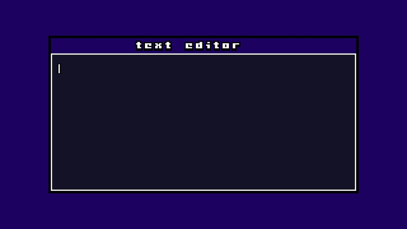
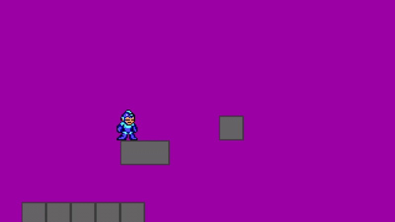
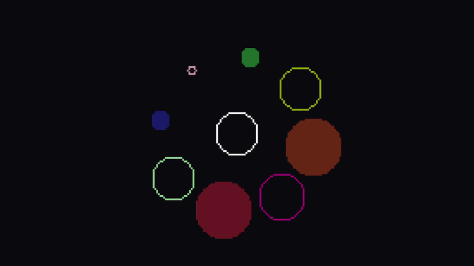
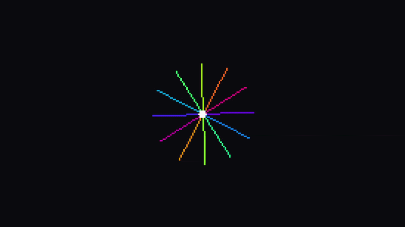
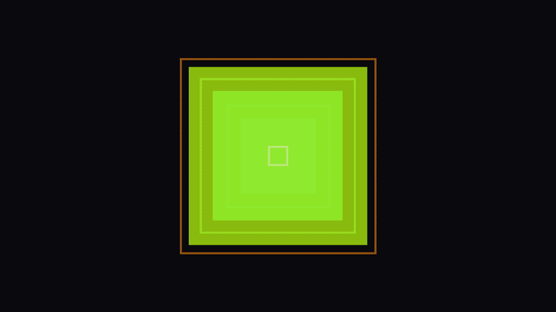

# GrnGame


<div style="display:flex;flex-direction:column;align-items:center;gap:8px">
  
  <div style="display:flex;gap:8px;width:100%">
    
    
  </div>
  <div style="display:flex;gap:8px;width:100%">
    
    
  </div>
</div>

GrnGame is a 2D game engine scripted in **LuaJIT**.

---

## Platforms

- Windows 7+ 64bit
- Ubuntu 18.04+ (and equivalent)  64bit
- macOS 64bit M1+

Everything is pre-compiled.

---

## Project Structure

```
/src/main.lua          ← entry point
/src/encryptFiles.py   ← resource encryption tool
/src/grngame_api.lua   ← API definitions (autocompletion)

./GrnGameAppLinux      ← Linux executable
./GrnGameAppWindows.exe
./GrnGameAppMacOs
./animation.lua        ← animation module
./physic.lua           ← physics module
```

> ⚠️ The working directory is the **execution directory**, not the location of `main.lua`.

---

## Create a Project

Clone the repo, move into `commandProject` and run:

```
python create_project.py <name> [path] [--level debug|release]
```
debug = with logs
release = no logs ⚠️​

---

## Loading Resources

**You must call `image.loadFolder(path)` before using any image or sprite from that folder.** Same applies to `song.loadFolder(path)` for audio. Resources are referenced by their path relative to the executable.

```lua
image.loadFolder("assets/")
image.loadFolder("assets/font")
song.loadFolder("assets/sounds")
```

---

## Distribution

**Encrypt resources** (images, sounds, JSON) with `encryptFiles.py`:

```
python encryptFiles.py <key_hex_32chars> [path] <iv_hex_32chars>
```

Encrypted files must use the `.data` extension. Set the key/IV **before** loading — they are valid for one frame only.

**Obfuscate your code** by bundling all dependencies into `main.lua` and compiling to LuaJIT bytecode.

---

Full examples are available in the `examples/` folder:

| Folder | Description |
|---|---|
| `examples/circles/` | Animated circles with colors |
| `examples/lines/` | Animated line patterns |
| `examples/rectangles/` | Animated rectangles |
| `examples/font/` | Text input and font rendering |
| `examples/particules/` | Particle system (1000 particles) |
| `examples/JsonExampleAndEncryption/` | JSON save/load with encryption |
| `examples/hitbox2d/` | **Platformer with physics, animation, camera** |
| `examples/hotReload/` | Hot reload of Lua modules |
| `examples/song/` | song |

<sub>for testing examples , you need to moove the correct App ( or all of then ) in the example folder. 
example : I moove GrnGameAppWindows.exe in examples/hitbox2d/ because i want to test platformer and I am on windows.</sub>

---

## API Reference

---

### utils

```lua
utils.setUpdateCallback(fn)     -- Set the main update function (called every frame)
utils.switchUpdateCallback(fn)  -- Switch the update function
utils.logMessage(level, msg)    -- Log a message (0=debug 1=info 2=warning 3=error)
utils.stopEngine()              -- Stop the engine
utils.setLogLvl(level)         -- Set minimum log level
utils.getInputText()            -- Get current text input → string (full history)
utils.deleteInputText()         -- Clear text input
utils.setWindowSize(w, h)      -- Set universe size
```

---

### window

```lua
window.fullscreen()             -- Exclusive fullscreen
window.windowedFullscreen()     -- Borderless fullscreen
window.windowed(w, h)          -- Windowed mode
window.windowedCoefficient(n)  -- Windowed mode with zoom coefficient
window.setFps(fps)             -- Set target FPS
window.setTitle(title)         -- Set window title
window.setBlackBars(bool)      -- Enable/disable black bars
window.setUniversSize(w, h)    -- Set universe size
```

---

### mouse

```lua
mouse.X()                    -- Mouse X in universe → number
mouse.Y()                    -- Mouse Y in universe → number
mouse.LeftJustPressed()      -- Left button just pressed this frame → boolean
mouse.RightJustPressed()     -- Right button just pressed this frame → boolean
mouse.LeftPressed()          -- Left button held down → boolean
mouse.RightPressed()         -- Right button held down → boolean
mouse.ScrollVertical()       -- Vertical scroll → integer
mouse.ScrollHorizontal()     -- Horizontal scroll → integer
mouse.showCursor(bool)       -- Show/hide cursor
```

---

### input

```lua
input.keyJustPressed(key)           -- Key just pressed → boolean
input.keyPressed(key)               -- Key held down → boolean
input.showCursor(bool)              -- Show/hide cursor
input.buttonJustPressed(btn, idx)   -- Controller button just pressed → boolean
input.buttonPressed(btn, idx)       -- Controller button held → boolean
input.initController(idx)           -- Initialize controller
input.getJoysticks(deadzone, idx)   -- Get axes {lx,ly,rx,ry,tl,tr} → table
input.closeController(idx)
input.closeJoystick(idx)
input.closeTheController(idx)
```

**Keyboard key names**

| Category | Keys |
|---|---|
| Letters | `a` `b` `c` `d` `e` `f` `g` `h` `i` `j` `k` `l` `m` `n` `o` `p` `q` `r` `s` `t` `u` `v` `w` `x` `y` `z` |
| Digits | `0` `1` `2` `3` `4` `5` `6` `7` `8` `9` |
| Symbols | `-` `=` `[` `]` `;` `'` `,` `.` `/` `` ` `` `\` |
| Function | `f1` … `f9` `f10` `f11` `f12` |
| Arrows | `left` `right` `up` `dn` (or `down`) |
| Special | `space` `enter` `return` `escape` `esc` `backspace` `delete` `insert` `tab` `end` `home` `pageup` `pagedown` |
| Modifiers | `shift` `lshift` `rshift` `ctrl` `control` `lctrl` `rctrl` `alt` `lalt` `ralt` `caps` `capslock` `numlock` `scrolllock` |
| Numpad | `kp0` … `kp9` `kp+` `kp-` `kp*` `kp/` `kp=` `kpe` `kp.` |
| Media | `volumeup` `volup` `volumedown` `voldown` `mute` `play` `stop` `next` `prev` |
| System | `print` `printscreen` `prtscr` `pause` `break` |

**Controller button names** (used with `input.buttonJustPressed` / `input.buttonPressed`)

| Names | Description |
|---|---|
| `a` `b` `x` `y` | Face buttons |
| `lb` / `l1` `rb` / `r1` | Shoulder buttons |
| `l3` `r3` | Stick clicks |
| `up` `down` `left` `right` | D-Pad |
| `start` `back` / `select` `guide` / `home` | Menu buttons |
| `share` `touchpad` | Misc (PS/Xbox) |
| `paddle1` `paddle2` `paddle3` `paddle4` | Paddles |

---

### var

```lua
var.delta()           -- Delta time in seconds → number
var.fps()             -- Current FPS → number
var.frameCount()      -- Total frames since start → integer
var.offsetX()         -- Render X offset → number
var.offsetY()         -- Render Y offset → number
var.currentWidth()    -- Window width → integer
var.currentHeight()   -- Window height → integer
var.universeWidth()   -- Universe width → integer
var.universeHeight()  -- Universe height → integer
var.windowMinimised() -- Is window minimized? → boolean
var.getTextDrop()     -- Dropped file path → string
```

---

### image

> ⚠️ You must call `image.loadFolder(path)` before drawing any image or sprite from that folder.

```lua
image.loadFolder(folder)     -- Preload all images in folder (required before use)
image.freeFolder()           -- Free loaded images

image.cls(r, g, b)           -- Clear screen

image.draw(path, x, y, coeff, [flip], [rotP], [rot], [alpha])
image.drawSprite(sprite, idx, x, y, coeff, [flip], [rot], [alpha])
image.drawText(font, text, x, y, scale, [flip], [spacing], [rotP], [rot], [alpha]) → number (drawn width)

image.drawRect(x, y, w, h, [r,g,b,a])          -- Rectangle outline
image.drawRectFilled(x, y, w, h, [r,g,b,a])    -- Filled rectangle
image.drawCircle(x, y, radius, [r,g,b,a])       -- Circle outline
image.drawCircleFilled(x, y, radius, [r,g,b,a]) -- Filled circle
image.drawLine(x1, y1, x2, y2, [r,g,b,a])       -- Line

image.Sprite(id, w, h)       -- Create Sprite object → Sprite
image.Particle(x, y, r, g, b, rotation, [alpha]) -- Create a Particle → Particle
image.Particles()            -- Create a Particles container → Particles
image.drawParticles(particles) -- Draw all particles (optimized)

image.setIcon(path)          -- Set window icon
image.setKey(index, value)   -- Set decryption key byte
image.setIv(index, value)    -- Set decryption IV byte
```

**Sprite object**

```lua
-- path must be inside a folder loaded with image.loadFolder()
local spr = image.Sprite("assets/player.png", 32, 32)
image.drawSprite(spr, frame, x, y, coeff)
```

**Font**

The font system uses a folder of images named by their ASCII code (e.g. `65.png` for `A`). Load the folder before use:

```lua
image.loadFolder("assets/font")
image.drawText("assets/font", "Hello!", 10, 10, 2)
```

**Particles**

```lua
local ps = image.Particles()
local p = image.Particle(x, y, 255, 255, 255, 0, 200)
ps:add(p)

-- in update:
image.drawParticles(ps)
```

`Particles` container methods: `add(p)`, `size()`, `get(index)`, `pairs()`

---

### song

> ⚠️ You must call `song.loadFolder(path)` before playing any audio from that folder.

```lua
song.loadFolder(path)        -- Preload all audio files in folder (required before use)
song.freeFolder()

song.play(path, [loop], [channel], [volume])
-- loop: 0 = once, -1 = infinite, n = n times
-- volume: 0-128

song.stop(path)
song.pause(path)
song.resume(path)
song.stopChannel(channel)
song.pauseChannel(channel)
song.resumeChannel(channel)
song.setKey(index, value)
song.setIv(index, value)
```

---

### json

```lua
json.load(filename)
json.save(filename)
json.delete(filename)
json.exists(filename)                        -- → boolean
json.writeVariable(filename, path, value)
json.readVariable(filename, path)            -- path="" reads root → value/table/nil
json.deleteVariable(filename, path)
json.setKey(index, value)
json.setIv(index, value)
```

---

### camera

```lua
camera.createCamera(x, y, smooth, w, h, left_limit, right_limit, top_limit, bottom_limit)
camera.updateCamera(tx, ty, dt)
camera.shakeCamera(intensity, duration, decay)

camera.setCameraX(v) / camera.getCameraX()
camera.setCameraY(v) / camera.getCameraY()
camera.setCameraSmooth(v) / camera.getCameraSmooth()
camera.setCameraW(v) / camera.getCameraW()
camera.setCameraH(v) / camera.getCameraH()
camera.setCameraLimitLeft(v) / camera.getCameraLimitLeft()
camera.setCameraLimitRight(v) / camera.getCameraLimitRight()
camera.setCameraLimitTop(v) / camera.getCameraLimitTop()
camera.setCameraLimitDown(v) / camera.getCameraLimitDown()
```

---

## Platformer Physics

Platformer physics (entities, block collision, wall jump, multi-jump) is handled via the `physic.lua` module available in `examples/hitbox2d/`. Copy `physic.lua` and `animation.lua` to your project root.

See `examples/hitbox2d/src/main.lua` for a full working example.

```lua
local physics = require("physic")
local animation = require("animation")

-- Player is a plain table with these fields:
local player = {
    x = 50, y = 50, w = 24, h = 24,
    gravity = 500,
    jumpPower = -250,       -- negative = upward
    speedMaxX = 3,
    initialSpeed = 0.1,
    acceleration = 3,
    jumpOnWall = true,
    numberOfJumpsPossible = 2,
}

-- Blocks: plain tables {x, y, w, h, type}
local map_blocks = {}
table.insert(map_blocks, {x=0, y=150, w=320, h=20, type=1})

local entities = { player }

-- In update:
player.requestLeft  = input.keyPressed("q")
player.requestRight = input.keyPressed("d")
player.requestJump  = input.keyJustPressed("space")

-- ignoreMask: bitfield — e.g. 8 = ignore block type 3 (1<<3)
physics.update(entities, map_blocks, 0, dt)
camera.updateCamera(player.x, player.y, dt)
```

**Entity fields (read/write):**
`x y w h speedX speedY inSky gravity jumpPower requestJump requestLeft requestRight initialSpeed acceleration numberOfJumps numberOfJumpsPossible jumpOnWall`

**Animation helper:**

```lua
-- animation.update(frame, timer, startFrame, endFrame, speed, dt, loop)
frame, animTimer = animation.update(frame, animTimer, 9, 12, 0.15, dt, true)

```

