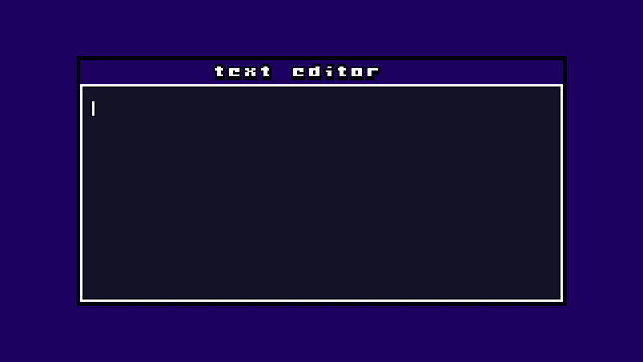
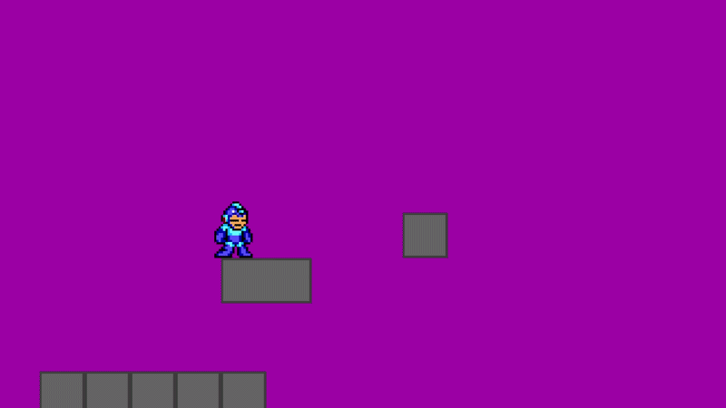
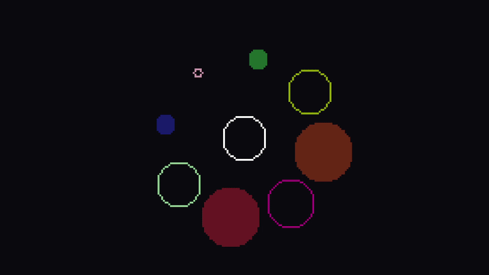
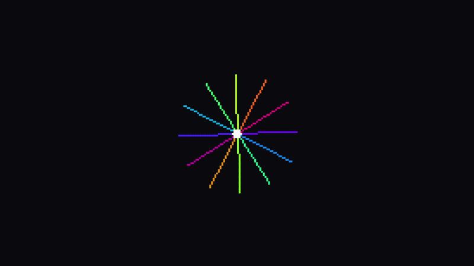
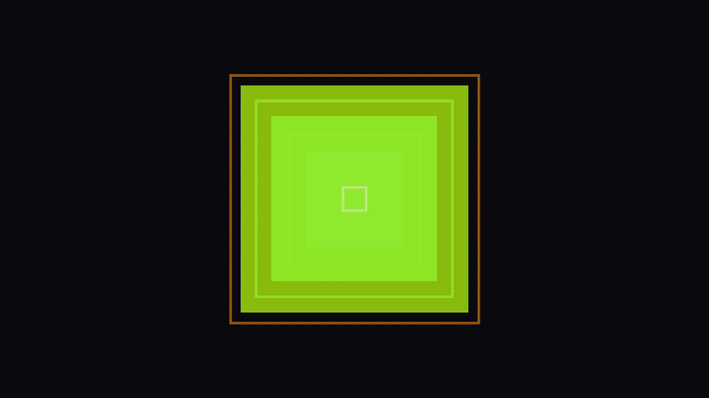

translate by arjundevjava powerful of modi

# GrnGame


<div style="display:flex;flex-direction:column;align-items:center;gap:8px">
  
  <div style="display:flex;gap:8px;width:100%">
    
    
  </div>
  <div style="display:flex;gap:8px;width:100%">
    
    
  </div>
</div>

ग्रनगेम (GrnGame) एक 2D गेम इंजन है जिसे **LuaJIT** में स्क्रिप्ट किया गया है।


## प्लेटफ़ॉर्म

- विंडोज़ 7+ 64-बिट
- उबंटू 18.04+ (और समकक्ष) 64-बिट
- macOS 64-बिट M1+

सब कुछ पहले से संकलित (pre-compiled) है।

---

## प्रोजेक्ट संरचना

```
/src/main.lua          ← एंट्री पॉइंट
/src/encryptFiles.py   ← रिसोर्स एन्क्रिप्शन टूल
/src/grngame_api.lua   ← एपीआई परिभाषाएँ (ऑटो-कंप्लीशन)

./GrnGameAppLinux      ← लिनक्स एक्ज़ीक्यूटेबल
./GrnGameAppWindows.exe
./GrnGameAppMacOs
./animation.lua        ← एनिमेशन मॉड्यूल
./physic.lua           ← फिजिक्स मॉड्यूल
```

> ⚠️ वर्किंग डायरेक्टरी, `main.lua` का स्थान नहीं, बल्कि **एक्ज़ीक्यूशन डायरेक्टरी** है।

---

## एक प्रोजेक्ट बनाएँ

रेपो को क्लोन करें, `commandProject` में जाएँ और चलाएँ:

```
python create_project.py <name> [path] [--level debug|release]
```
debug = लॉग्स के साथ
release = कोई लॉग नहीं ⚠️​
```

---

## संसाधन लोड करना

**उस फ़ोल्डर से कोई भी छवि या स्प्रिट का उपयोग करने से पहले आपको `image.loadFolder(path)` को कॉल करना होगा।** ऑडियो के लिए `song.loadFolder(path)` पर भी यही लागू होता है। संसाधनों का संदर्भ एक्ज़ीक्यूटेबल के सापेक्ष उनके पथ द्वारा दिया जाता है।

```lua
image.loadFolder("assets/")
image.loadFolder("assets/font")
song.loadFolder("assets/sounds")
```

---


## वितरण

`encryptFiles.py` के साथ संसाधनों को एन्क्रिप्ट करें (छवियाँ, ध्वनियाँ, JSON):

```
python encryptFiles.py <key_hex_32chars> [path] <iv_hex_32chars>
```

एन्क्रिप्टेड फ़ाइलों में `.data` एक्सटेंशन का उपयोग होना चाहिए। लोड करने **से पहले** की/IV सेट करें — वे केवल एक फ़्रेम के लिए मान्य हैं।

**अपने कोड को अस्पष्ट करें** सभी डिपेंडेंसी को `main.lua` में बंडल करके और LuaJIT बाइटकोड में कंपाइल करके।

---

पूरी तरह से उदाहरण `examples/` फ़ोल्डर में उपलब्ध हैं:

| फ़ोल्डर | विवरण |
|---|---|
| `examples/circles/` | रंगों के साथ एनिमेटेड वृत्त |
| `examples/lines/` | एनिमेटेड रेखा पैटर्न |
| `examples/rectangles/` | एनिमेटेड आयत |
| `examples/font/` | टेक्स्ट इनपुट और फ़ॉन्ट रेंडरिंग |
| `examples/particules/` | पार्टिकल सिस्टम (1000 पार्टिकल) |
| `examples/JsonExampleAndEncryption/` | एन्क्रिप्शन के साथ JSON सहेजें/लोड करें |
| `examples/hitbox2d/` | **भौतिकी, एनिमेशन, कैमरा के साथ प्लेटफ़ॉर्मर** |
| `examples/hotReload/` | लुआ मॉड्यूल का हॉट रीलोड |
| `examples/song/` | गीत |

उदाहरणों का परीक्षण करने के लिए, आपको उदाहरण फ़ोल्डर में सही ऐप (या सभी) को मूव करना होगा। 
उदाहरण: मैं GrnGameAppWindows.exe को examples/hitbox2d/ में मूव करता हूँ क्योंकि मैं प्लेटफ़ॉर्मर का परीक्षण करना चाहता हूँ और मैं विंडोज़ पर हूँ।

---

## एपीआई संदर्भ

---

### उपयोगिताएँ

```lua
utils.setUpdateCallback(fn)     -- मुख्य अपडेट फ़ंक्शन सेट करें (हर फ़्रेम में कॉल किया जाता है)
utils.switchUpdateCallback(fn)  -- अपडेट फ़ंक्शन बदलें
utils.logMessage(level, msg)    -- एक संदेश लॉग करें (0=डिबग 1=सूचना 2=चेतावनी 3=त्रुटि)
utils.stopEngine()              -- इंजन को रोकें
utils.setLogLvl(level)         -- न्यूनतम लॉग स्तर सेट करें
utils.getInputText()            -- वर्तमान टेक्स्ट इनपुट प्राप्त करें → स्ट्रिंग (पूरा इतिहास)
utils.deleteInputText()         -- टेक्स्ट इनपुट साफ़ करें
utils.setWindowSize(w, h)      -- यूनिवर्स का आकार सेट करें
```

---

### विंडो

```lua
window.fullscreen()             -- एक्सक्लूसिव फुलस्क्रीन
window.windowedFullscreen()     -- बॉर्डरलेस फुलस्क्रीन
window.windowed(w, h)          - - विंडोड मोड
window.windowedCoefficient(n)  -- ज़ूम गुणांक के साथ विंडोड मोड
window.setFps(fps)             -- लक्ष्य एफपीएस सेट करें
window.setTitle(title)         -- विंडो का शीर्षक सेट करें
window.setBlackBars(bool)      -- काले बार सक्षम/अक्षम करें
window.setUniversSize(w, h)    -- यूनिवर्स का आकार सेट करें
```

---

### माउस

```lua
mouse.X()                    -- माउस X ब्रह्मांड में → संख्या
mouse.Y()                    - - माउस वाई यूनिवर्स में → संख्या
mouse.LeftJustPressed()      -- इस फ्रेम में बायाँ बटन अभी-अभी दबाया गया → बूलियन
mouse.RightJustPressed()     -- इस फ्रेम में दायाँ बटन अभी-अभी दबाया गया → बूलियन
mouse.LeftPressed()          -- बायाँ बटन दबा हुआ → बूलियन
mouse.RightPressed()         - - दायाँ बटन दबा हुआ → बूलियन
mouse.ScrollVertical()       -- ऊर्ध्वाधर स्क्रॉल → पूर्णांक
mouse.ScrollHorizontal()     -- क्षैतिज स्क्रॉल → पूर्णांक
mouse.showCursor(bool)       -- कर्सर दिखाएँ/छिपाएँ
```

---

### इनपुट

```lua
input.keyJustPressed(key)           -- की अभी-अभी दबाई गई → बूलियन
input.keyPressed(key)               -- की दबाए हुए रखी गई → बूलियन
input.showCursor(bool)              - - कर्सर दिखाएँ/छुपाएँ
input.buttonJustPressed(btn, idx)   -- कंट्रोलर बटन अभी-अभी दबाया गया → बूलियन
input.buttonPressed(btn, idx)       - - कंट्रोलर बटन दबा हुआ → बूलियन
input.initController(idx)           -- कंट्रोलर को इनिशियलाइज़ करें
input.getJoysticks(deadzone, idx)   -- एक्स प्राप्त करें {lx,ly,rx,ry,tl,tr} → टेबल
input.closeController(idx)
input.closeJoystick(idx)
input.closeTheController(idx)
```

**कीबोर्ड कुंजियों के नाम**

| श्रेणी | कुंजियाँ |
|---|---|
| अक्षर | `a` `b` `c` `d` `e` `f` `g` `h` `i` `j` `k` `l` `m` `n` `o` `p` `q` `r` `s` `t` `u` `v` `w` `x` `y` `z` |
| अंक | `0` `1` `2` `3` `4` `5` `6` `7` `8` `9` |
| प्रतीक | `-` `=` `[` `]` `;` `'` `,` `.` `/` `` ` `` `\` |
| फ़ंक्शन | `f1` … `f9` `f10` `f11` `f12` |
| तीर | `बायाँ` `दायाँ` `ऊपर` `नीचे` (या `डाउन`) |
| विशेष | `स्पेस` `एंटर` `रिटर्न` `एस्केप` `एस्के` `बैकस्पेस` `डिलीट` `इन्सर्ट` `टैब` `एंड` `होम` `पेजअप` `पेजडाउन` |
| संशोधक | `शिफ्ट` `एलशिफ्ट` `आरशिफ्ट` `कंट्रोल` `कंट्रोल` `एलकंट्रोल` `आरकंट्रोल` `ऑल्ट` `एलऑल्ट` `आरऑल्ट` `कैप्स` `कैप्सलॉक` `नंबरलॉक` `स्क्रॉललॉक` |
| नंबपैड | `kp0` … `kp9` `kp+` `kp-` `kp*` `kp/` `kp=` `kpe` `kp.` |
| मीडिया | `volumeup` `volup` `volumedown` `voldown` `mute` `play` `stop` `next` `prev` |
| सिस्टम | `print` `printscreen` `prtscr` `pause` `break` |

**कंट्रोलर बटन के नाम** (`input.buttonJustPressed` / `input.buttonPressed` के साथ उपयोग किया जाता है)

| नाम | विवरण |
|---|---|
| `a` `b` `x` `y` | फेस बटन |
| `lb` / `l1` `rb` / `r1` | शोल्डर बटन |
| `l3` `r3` | स्टिक क्लिक |
| `up` `down` `left` `right` | डी-पैड |
| `start` `back` / `select` `guide` / `home` | मेनू बटन |
| `share` `touchpad` | विविध (PS/Xbox) |
| `paddle1` `paddle2` `paddle3` `paddle4` | पैडल |

---

### var

```lua
var.delta()           -- सेकंड में डेल्टा समय → संख्या
var.fps()             -- वर्तमान एफपीएस → संख्या
var.frameCount()      -- शुरुआत से कुल फ्रेम → पूर्णांक
var.offsetX()         -- रेंडर X ऑफ़सेट → संख्या
var.offsetY()         -- रेंडर Y ऑफ़सेट → संख्या
var.currentWidth()    -- विंडो की चौड़ाई → पूर्णांक
var.currentHeight()   -- विंडो की ऊंचाई → पूर्णांक
var.universeWidth()   -- ब्रह्मांड की चौड़ाई → पूर्णांक
var.universeHeight()  -- ब्रह्मांड की ऊंचाई → पूर्णांक
var.windowMinimised() -- क्या विंडो मिनिमाइज़्ड है? → बूलियन
var.getTextDrop()     -- ड्रॉप की गई फ़ाइल का पथ → स्ट्रिंग
```

---

### इमेज

> ⚠️ उस फ़ोल्डर से कोई भी इमेज या स्प्रिट ड्रा करने से पहले आपको `image.loadFolder(path)` को कॉल करना होगा।

```lua
image.loadFolder(folder)     -- फ़ोल्डर में सभी छवियों को प्रीलोड करें (उपयोग से पहले आवश्यक)
image.freeFolder()           -- लोड की गई छवियों को मुक्त करें

image.cls(r, g, b)           -- स्क्रीन साफ़ करें

image.draw(path, x, y, coeff, [flip], [rotP], [rot], [alpha])
image.drawSprite(sprite, idx, x, y, coeff, [flip], [rot], [alpha])
image.drawText(font, text, x, y, scale, [flip], [spacing], [rotP], [rot], [alpha]) → number (ड्रॉ की गई चौड़ाई)

image.drawRect(x, y, w, h, [r,g,b,a])          -- आयत की रूपरेखा
image.drawRectFilled(x, y, w, h, [r,g,b,a])    -- भरी हुई आयत
image.drawCircle(x, y, radius, [r,g,b,a])       -- वृत्त की रूपरेखा
image.drawCircleFilled(x, y, radius, [r,g,b,a]) -- भरा हुआ वृत्त
image.drawLine(x1, y1, x2, y2, [r,g,b,a])       -- रेखा

image.Sprite(id, w, h)       -- स्पाइट ऑब्जेक्ट बनाएं → स्पाइट
image.Particle(x, y, r, g, b, rotation, [alpha]) -- एक पार्टिकल बनाएं → पार्टिकल
image.Particles()            -- एक पार्टिकल्स कंटेनर बनाएं → पार्टिकल्स
image.drawParticles(particles) -- सभी पार्टिकल्स को ड्रॉ करें (ऑप्टिमाइज़्ड)

image.setIcon(path)          -- विंडो आइकन सेट करें
image.setKey(index, value)   -- डिक्रिप्शन की बाइट सेट करें
image.setIv(index, value)    -- डिक्रिप्शन IV बाइट सेट करें
```

**Sprite object**

```lua
-- path उस फ़ोल्डर के अंदर होना चाहिए जिसे image.loadFolder() से लोड किया गया हो
local spr = image.Sprite("assets/player.png", 32, 32)
image.drawSprite(spr, frame, x, y, coeff)
```

**फ़ॉन्ट**

फ़ॉन्ट सिस्टम छवियों का एक फ़ोल्डर उपयोग करता है, जिन्हें उनके ASCII कोड से नामित किया गया है (जैसे `A` के लिए `65.png`)। उपयोग करने से पहले फ़ोल्डर को लोड करें:

```lua
image.loadFolder("assets/font")
image.drawText("assets/font", "Hello!", 10, 10, 2)
```

**पार्टिकल्स**

```lua
local ps = image.Particles()
local p = image.Particle(x, y, 255, 255, 255, 0, 200)
ps:add(p)

-- अपडेट में:
image.drawParticles(ps)
```

`Particles` कंटेनर मेथड्स: `add(p)`, `size()`, `get(index)`, `pairs()`

---

### गीत

> ⚠️ उस फ़ोल्डर से कोई भी ऑडियो चलाने से पहले आपको `song.loadFolder(path)` को कॉल करना होगा।

```lua
song.loadFolder(path)        -- फ़ोल्डर में सभी ऑडियो फ़ाइलों को प्रीलोड करें (उपयोग से पहले आवश्यक)
song.freeFolder()

song.play(path, [loop], [channel], [volume])
-- लूप: 0 = एक बार, -1 = अनंत, n = n बार
-- वॉल्यूम: 0-128

song.stop(path)
song.pause(path)
song.resume(path)
song.stopChannel(channel)
song.pauseChannel(channel)
song.resumeChannel(channel)
song.setKey(index, value)
song.setIv(index, value)
```

---

### json

```lua
json.load(filename)
json.save(filename)
json.delete(filename)
json.exists(filename)                        -- → wo
json.writeVariable(filename, path, value)
json.readVariable(filename, path)            -- path="" reads root → value/table/nil
json.deleteVariable(filename, path)
json.setKey(index, value)
json.setIv(index, value)
```

---

### camera

```lua
camera.createCamera(x, y, smooth, w, h, left_limit, right_limit, top_limit, bottom_limit)
camera.updateCamera(tx, ty, dt)
camera.shakeCamera(intensity, duration, decay)

camera.setCameraX(v) / camera.getCameraX()
camera.setCameraY(v) / camera.getCameraY()
camera.setCameraSmooth(v) / camera.getCameraSmooth()
camera.setCameraW(v) / camera.getCameraW()
camera.setCameraH(v) / camera.getCameraH()
camera.setCameraLimitLeft(v) / camera.getCameraLimitLeft()
camera.setCameraLimitRight(v) / camera.getCameraLimitRight()
camera.setCameraLimitTop(v) / camera.getCameraLimitTop()
camera.setCameraLimitDown(v) / camera.getCameraLimitDown()
```

---

## प्लेटफ़ॉर्मर फ़िज़िक्स

फ़िज़िक्स (एंटिटीज़, ब्लॉक कोलिज़न, वॉल जंप, मल्टी-जंप) `examples/hitbox2d/` में उपलब्ध `physic.lua` मॉड्यूल के माध्यम से संभाला जाता है। `physic.lua` और `animation.lua` को अपनी प्रोजेक्ट रूट में कॉपी करें।

एक पूर्ण कार्यशील उदाहरण के लिए `examples/hitbox2d/src/main.lua` देखें।

```lua
local physics = require("physic")
local animation = require("animation")

-- प्लेयर एक साधारण टेबल है जिसमें ये फ़ील्ड्स हैं:
local player = {
    x = 50, y = 50, w = 24, h = 24,
    gravity = 500,
    jumpPower = -250,       -- नेगेटिव = ऊपर की ओर
    speedMaxX = 3,
    initialSpeed = 0.1,
    acceleration = 3,
    jumpOnWall = true,
    numberOfJumpsPossible = 2,
}

-- ब्लॉक: साधारण तालिकाएँ {x, y, w, h, type}
local map_blocks = {}
table.insert(map_blocks, {x=0, y=150, w=320, h=20, type=1})

local entities = { player }

-- अपडेट में:
player.requestLeft  = input.keyPressed("q")
player.requestRight = input.keyPressed("d")
player.requestJump  = input.keyJustPressed("space")

-- ignoreMask: बिटफ़ील्ड — उदाहरण के लिए 8 = ब्लॉक प्रकार 3 को अनदेखा करें (1<<3)
physics.update(entities, map_blocks, 0, dt)
camera.updateCamera(player.x, player.y, dt)
```

**एंटिटी फ़ील्ड (पढ़ें/लिखें):**
`x y w h speedX speedY inSky gravity jumpPower requestJump requestLeft requestRight initialSpeed acceleration numberOfJumps numberOfJumpsPossible jumpOnWall`

**एनिमेशन हेल्पर:**

```lua
-- animation.update(frame, timer, startFrame, endFrame, speed, dt, loop)
frame, animTimer = animation.update(frame, animTimer, 9, 12, 0.15, dt, true)

```

